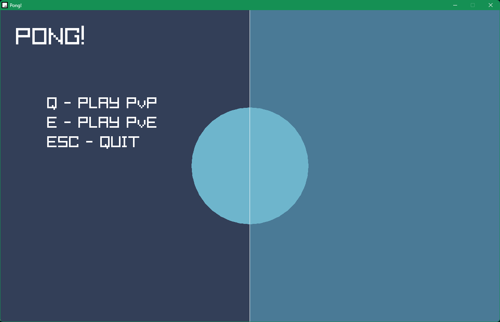
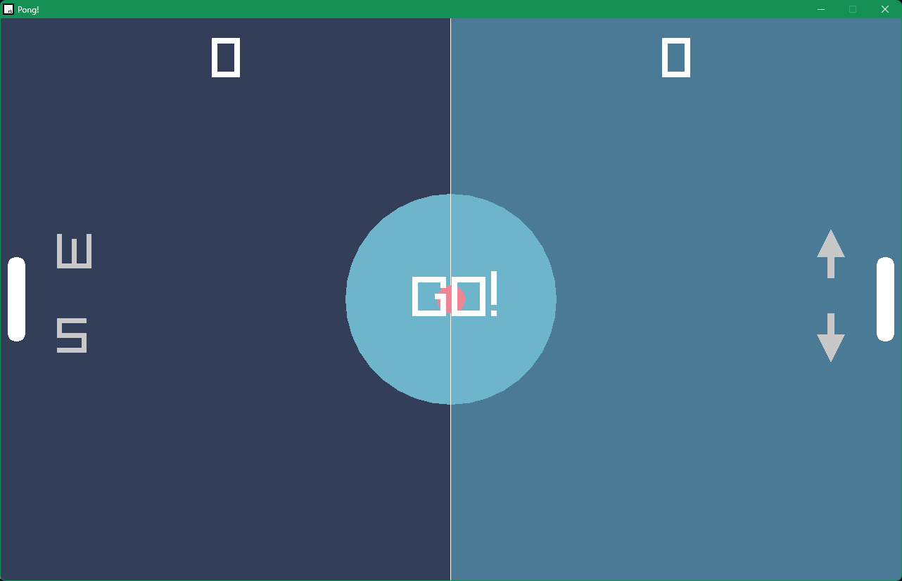
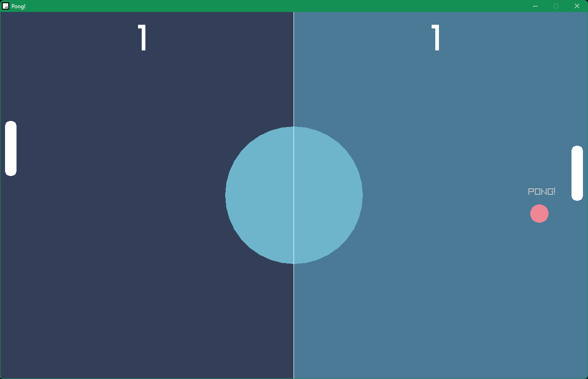

## Pong!

### Description

Simple Pong game made with raylib.

### Features

 - Play up to two players
 - Play against a CPU controlled padddle

### Controls

Player 1:
 - W
 - S
   
Player 2:
 - Up arrow
 - Down arrow

### Screenshots

